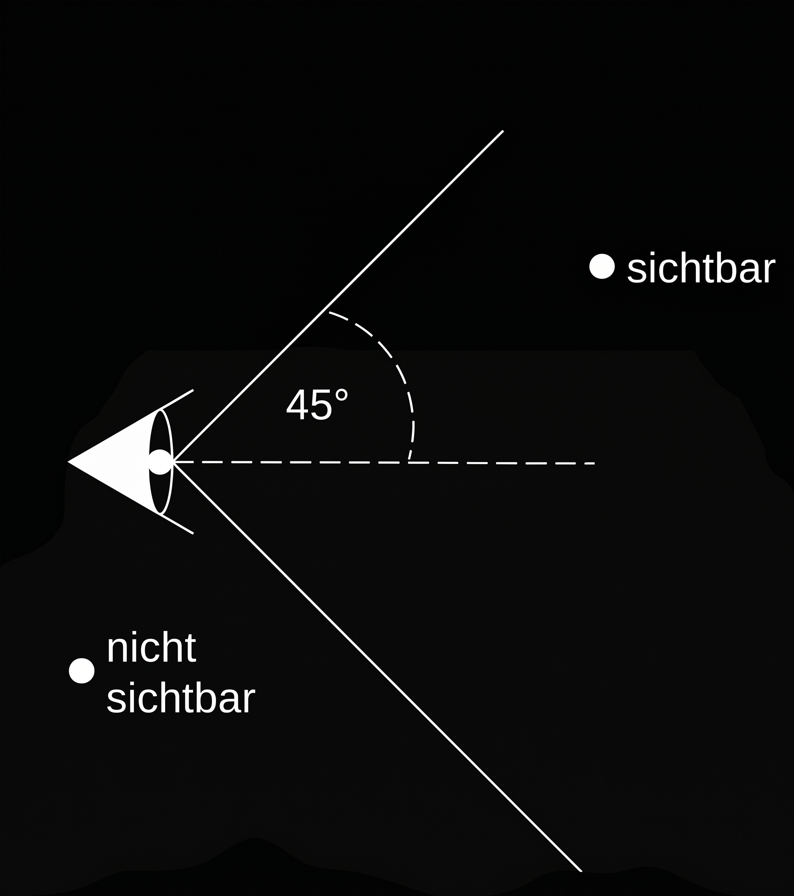

# Objektorientierte Programmierung 2

## Aufgaben

Erweitern Sie Ihre Lösung des letzten Übungsblattes um die folgenden Komponenten:

---

### Aufgabe 1

a. Erweitern Sie die Klassen `Punkt` und `Koerper` um eine statische Klassenvariable `public static boolean DEMO`. Mit dieser Variablen sollen Ausgaben der einzelnen Methoden auf die Konsole gesteuert werden (s. u.). Setzen Sie den Wert der Variablen initial auf den Wert `false`.

b. Erweitern Sie die Methoden der Klassen `Punkt`, `Koerper`, `Kugel`, `Wuerfel` und aller weiteren Klassen dieses Aufgabenblattes so, dass jeweils als erste Anweisung der Wert der Variablen `DEMO` geprüft wird. Falls der Wert `true` ist, soll die Methode auf der Konsole ihre Identität bekanntgeben.

**Beispielausgabe:**
```text
Klasse: Koerper - Methode: abstand
```

c. Schalten Sie in den Testklassen der folgenden Aufgaben den Demomodus der Methoden ein, indem Sie die Variablen auf den Wert `true` setzen.

---

### Aufgabe 2

Implementieren Sie eine Klasse `MultiKoerper`, welche zusammengesetzte dreidimensionale geometrische Körper im $\mathbb{R}^3$ repräsentiert. Ein `MultiKoerper` besteht aus einer Menge von Objekten des Typs `Koerper`. Die einzelnen `Koerper` werden in einem Array abgelegt. Die Koordinate des zusammengesetzten Körpers ist die Koordinate des zuerst hinzugefügten Objekts vom Typ `Koerper`. Die Klasse `MultiKoerper` soll von der Klasse `Koerper` abgeleitet sein.

**Komponenten der Klasse `MultiKoerper`:**

* Privates Attribut `Koerper[] komponenten`, das die Teilkörper speichert.
* Konstruktor mit einem Parameter, der die Anzahl der Teilkörper repräsentiert.
* Parameterloser Konstruktor, der die Anzahl der Teilkörper auf 1 festlegt. Der parameterlose Konstruktor verwendet den anderen, parametrisierten Konstruktor.
* Methode `public void einfuegen(Koerper k)`, welche den übergebenen Körper hinzufügt. Achten Sie darauf, dass das Array `komponenten` ggf. schon voll ist. Der neue Körper soll in jedem Fall eingefügt werden.
* Eine öffentliche Methode, welche die Anzahl der Teilkörper zurückliefert.
* Überschreiben Sie die Methoden der Klasse `Koerper` in geeigneter Form (Sie müssen in diesen Methoden meist über das Array `komponenten` iterieren). Denken Sie auch an die `toString`-Methode.

Implementieren Sie eine Klasse `MultiKoerperTest`, mit der Sie Ihre Klasse testen. Fügen Sie dabei sowohl Kugeln als auch Würfel ein. Überlegen Sie immer zuerst, welche Methoden in welcher Reihenfolge aufgerufen werden. Verwenden Sie den Demomodus für Methoden, um die Effekte von Polymorphie und später Bindung zu beobachten.

---

### Aufgabe 3

In der vorherigen Aufgabe haben Sie festgestellt, dass die Speicherung einer wachsenden Anzahl von Teilkörpern in einem Array mühsam sein kann, wenn die Größe des Arrays geändert werden muss. In der Java-API sind bereits Klassen enthalten, welche die flexible Speicherung von Objekten erlauben. Recherchieren Sie die Klasse `java.util.ArrayList` und ändern Sie die Klasse `MultiKoerper` so ab, dass sie für das Attribut `komponenten` eine `ArrayList` verwendet.

Die Klasse `ArrayList` gehört zum Collections-Framework der Java-API, welches auf Generics aufbaut. Das bedeutet, dass Sie in spitzen Klammern hinter dem Typ noch den Typ der abzuspeichernden Objekte angeben sollen (`ArrayList<Koerper>`). Sie können die spitzen Klammern aber auch vorerst weglassen und die Warnungen von Eclipse („!ArrayList is a raw type...“) ignorieren. Dann müssen Sie beim Auslesen von Objekten aus der `ArrayList` explizit auf `Koerper` casten.

---

### Aufgabe 4

Implementieren Sie eine Klasse `Szene`, welche eine Szene aus verschiedenen Körpern im $\mathbb{R}^3$ repräsentiert.

**Komponenten der Klasse `Szene`:**

* Öffentliche statische Klassenvariable `DEMO` wie oben.
* Privates Attribut `ArrayList<Koerper> elemente`, das die in der Szene enthaltenen Körper speichert.  
  *Hinweis:* Da `MultiKoerper` von `Koerper` abgeleitet ist, können auch zusammengesetzte Körper in der Szene liegen.
* Privates Attribut `blickrichtung` vom Typ `Punkt`. Dieses Attribut stellt einen Ortsvektor vom Ursprung in Richtung des angegebenen Punktes dar und repräsentiert die Blickrichtung des Betrachters. Recherchieren Sie ggf., was ein Ortsvektor ist. Das Auge des Betrachters ist also immer im Ursprung und hat ein kegelförmiges Sichtfeld von $45^\circ$:



* Konstruktor mit drei Parametern: für die x-, y- und z-Werte der Blickrichtung.
* Parameterloser Konstruktor, der die Blickrichtung auf $(0, 0, 1)$ setzt.
* Setter-Methode für die Blickrichtung.
* Methode `public void einfuegen(Koerper k)`, welche den übergebenen Körper in die Szene einfügt.
* Methode `public boolean sichtbar(Koerper k)`, die testet, ob der Körper `k` sichtbar ist. Ein Körper ist sichtbar, wenn seine Koordinate im Sichtfeld liegt.
* Methode `public ArrayList<Koerper> sichtbar()`, welche alle aktuell sichtbaren Körper der Szene in einer `ArrayList` zurückliefert.
* Methode `public String toString()`, zeigt alle in der Szene enthaltenen Körper an. Die sichtbaren Körper sind durch den Präfix `sichtbar:` gekennzeichnet.

Implementieren Sie eine Klasse `SzeneTest`, mit der Sie Ihre Klasse testen. Denken Sie daran, auch `MultiKoerper` einzufügen und zwischenzeitlich die Blickrichtung zu ändern.

---